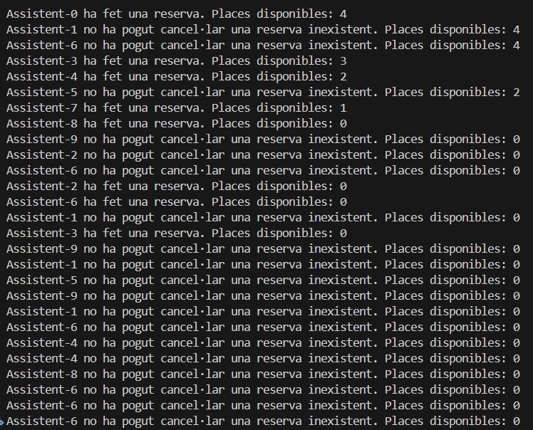
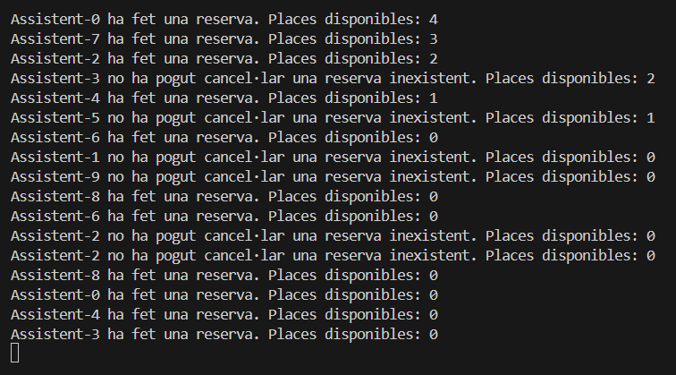

## Per què s’atura l’execució al cap d’un temps?
Porque todos los Asistentes se quedan esperando un hueco libre.

## Què passaria si en lloc de una probabilitat de 50%-50% fora de 70%(ferReserva)-30%(cancel·lar)? I si foren al revés les probabilitats? → Mostra la porció de codi modificada i la sortida resultant en cada un dels 2 casos.

## Perquè creus que fa falta la llista i no valdria només amb una variable sencera de reserves?
Porque si no no sabríamos qué asistentes han asistido.